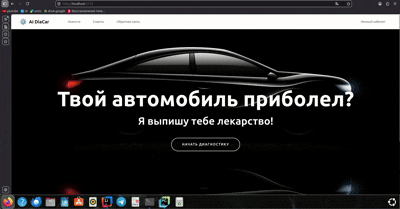
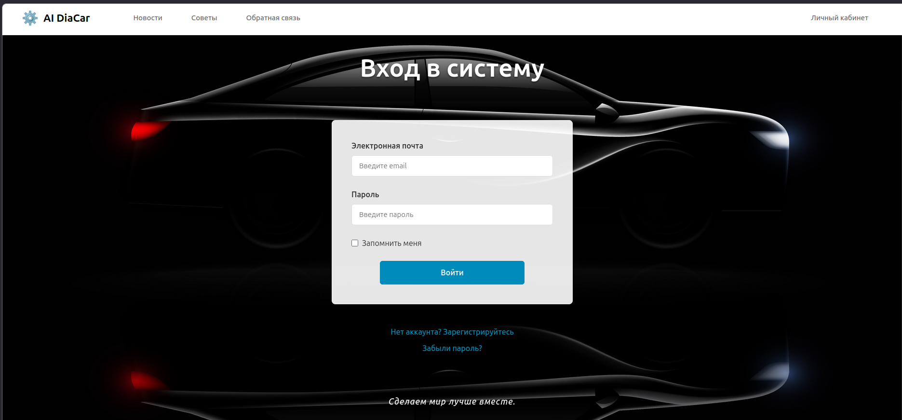
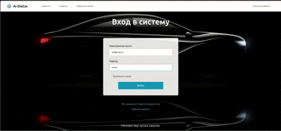
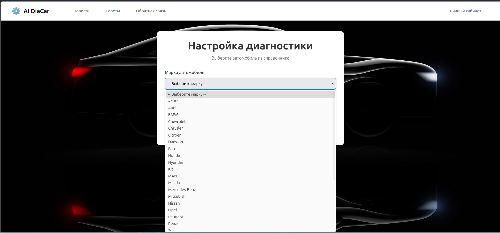
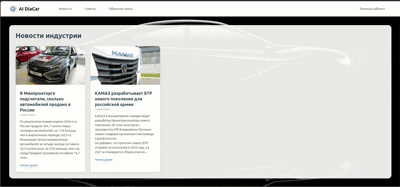
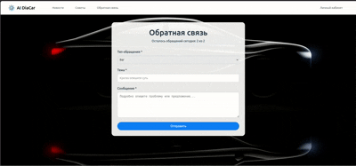
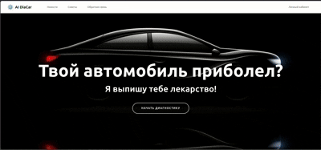

  # Интеллектуальная веб-платформа для первичной диагностики неисправностей автомобилей на основе ИИ
AI-DiaCar — это дипломный проект, представляющий собой веб-приложение для автоматизированной диагностики автомобилей. Система анализирует описание симптомов пользователем, учитывает характеристики автомобиля и с помощью методов машинного обучения (обработка естественного языка, векторный поиск, LLM) формирует структурированное заключение с вероятной причиной неисправности и рекомендациями по устранению.
# Цель проекта
- Разработать веб-платформу, которая позволяет владельцам автомобилей:
- Описывать проблему в свободной форме на русском языке;
- Получать структурированное заключение о вероятной неисправности;
- Изучать соответствующие страницы технической документации (PDF-руководства);
- Скачивать PDF-отчёт с историей диалога и изображениями страниц мануала.
# Ключевые возможности
- 🔐 Регистрация и JWT-аутентификация с ролевой моделью (пользователь / администратор);

- 🚘 Справочник автомобилей с возможностью динамического выбора марки, модели и года выпуска;

- 💬 Диалоговый ИИ-помощник с контекстным анализом симптомов;

- 📄 Векторный и эвристический поиск по структурированной базе знаний (JSON) и тексту PDF-руководств;

- 🧠 Гибридная генерация ответов (LLM через OpenRouter API + шаблонный резерв);

- 📖 Просмотр страниц руководства прямо в чате (конвертация PDF-страниц в PNG);

- 📥 Экспорт диагностической сессии в PDF-отчёт;

- ⏱ Автоматическая очистка устаревших сессий (старше 7 дней);

- 🛠 Администрирование справочников, обратной связи и дообучение модели (в перспективе).
# Демонстрация работы веб-приложения

# Backend
Backend - Spring Boot-приложение, реализующее бизнес-логику, управление сессиями, генерацию PDF-отчётов и взаимодействие с ML-сервисом.
# Frontend
Frontend - одностраничное приложение на React, интерфейс для диагностики и личного кабинета.внешняя оболочка работающего веб-приложения.
# ML-сервис
ML-service - отдельный микросервис на Python/FastAPI, выполняющий интеллектуальный анализ запросов.
# Технологический стек
- Backend: Java 17, Spring Boot, Spring Data JPA, Spring Security, JWT, Apache PDFBox
- Frontend:	React, TypeScript, Material UI (MUI), Axios
- ML-сервис:	Python 3.10+, FastAPI, Sentence-Transformers, Chroma, pdfplumber, Tesseract OCR
- База данных:	PostgreSQL
- Инфраструктура:	Docker, Docker Compose (планируется), REST API
- LLM:	OpenRouter API
# Запуск приложения
Требования: Docker и Docker Compose, Java 17, Maven, Node.js 18+, Python 3.10+, PostgreSQL 15+
После запуска доступ осуществляется по следующим ссылкам:
- Frontend: http://localhost:3000
- Backend API: http://localhost:8080
- ML-сервис: http://localhost:8000
# Изображения веб-приложения
- Главная страница

- Авторизация

- Личный аккаунт

- Выбор автомобиля

- Новости и советы

- Обратная связь

- Диагностика

# Пример работы веб-приложения
- Пользователь регистрируется и входит в систему.
- Выбирает автомобиль (марка, модель, год) из справочника.
- Начинает диалог с ИИ-помощником, описывая проблему: «Машина глохнет на холостых, обороты плавают, когда прогревается — пропадает»
- ML-сервис: Анализирует текст (нормализация, выделение ключевых слов);
- Ищет в JSON-базе знаний и/или PDF-руководстве релевантные записи;
- Генерирует ответ (через LLM или шаблонный генератор).
- Ответ выводится в чат вместе с предложенными страницами руководства.
- Пользователь может запросить страницу — она конвертируется в PNG и показывается в чате.
- По завершении сессии скачивает PDF-отчёт со всей перепиской и изображениями.
# Лицензия
Проект распространяется под лицензией MIT. Подробнее см. файл LICENSE.
# Контакты
- **GitHub**: https://github.com/MathewLyricist
- **Telegram**: @MathewChao
